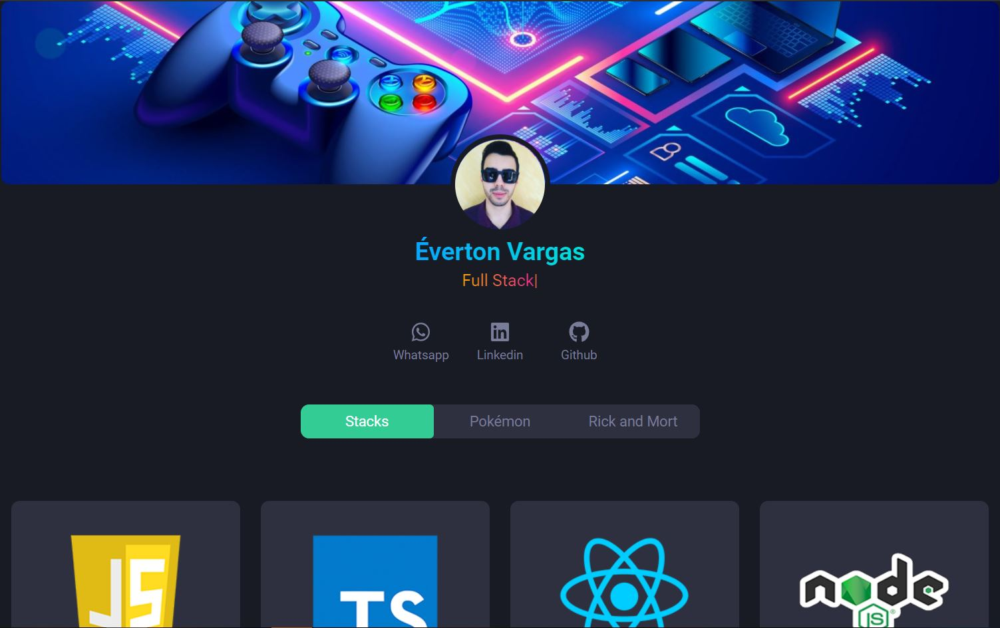

# GoBeyond Shop

<h1 align="center">
    
</h1>

## 🚀 O desafio

Fazer um site de portifolio conforme o design que foi passado.

Site: portifolio-silk.vercel.app

## :crystal_ball: Technologies

Este projeto foi desenvolvido utilizando as seguintes tecnologias:
- [React](https://reactjs.org)
- [TypeScript](https://www.typescriptlang.org/)
- [Sass](https://sass-lang.com/)
- [Typist](https://www.npmjs.com/package/react-typist)

## :arrow_forward: Instalação e uso

Clone o projeto e acesse a pasta

```bash
$ git clone https://github.com/evertonvargas/Portifolio

```

Siga os passos abaixo
```bash
# Install the dependencies
$ npm i or yarn

# Start the project
$ yarn dev or npm run dev
```
